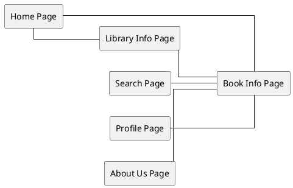

## Homepage 
Profile ,book info,library ,search ,about 
## Book info 
homepage,search,profile,library,about
## Library 
homepage ,search ,profile,book info ,about 
## Search
homepage,profile ,about ,book info 
## profile 
homepage ,search ,about ,book info ,library 
## about 
homepage ,search ,profile

```plantuml
@startuml
skinparam linetype ortho

object Item1
object Item2
object Item3


Item1 -right-> Item2 
' -right-> Item3

' Item1 --> Item2 --> Item3

@enduml
```

